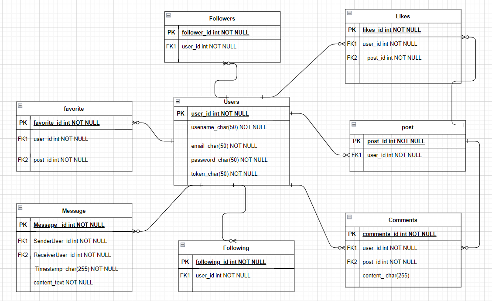

# Photography Platform
----
**Description**: Photographers can showcase their exceptional work on this site and interact with other users, receiving valuable likes and comments. For users, if you're looking for photography services, Explore the photographers' portfolios, or simply request a specific service by providing a description of your requirements.
## Vision
#### What is the vision of this product?
to provide a place specialized for photographers in order to upload their photos and built a portofolio, as well as share the experience and the opinions
#### What pain point does this project solve?
lacking a proper place to publish and exchange photos for the photographers, and a place to look for a certain image in your mind
#### Why should we care about your product?
if you are a photographer looking for a place to show and upload your photos, or to get inspired and give your opinion on other photographers work, and even if you just looking for a certain photo or an inspiration, then our prouct might be the best solution for that
## Scope (In/Out)
#### IN - What will your product do
##### Describe the individual features that your product will do.
| Feature                  | Description                                      
|--------------------------|---------------------------------------------------|-------------------------------------|
| Authentication/Authorization | Manage user access and permissions.           
| Add Photo                | Allows users to upload and add photos.         
| Like, Comment, Share     | Interact with photos by liking, commenting, and sharing. A                             |
| Follow                   | Follow other users to get updates on their content. 
| Chat                     | Enable users to chat with each other.           
| Routes                   | Manage and view routes.                      
| Request Photography      | Request a photography service or session.       

#### High-Level Overviews:

- **Authentication/Authorization**: Each user should sign up on the platform and then sign in. The visitor can just browse without taking any action. This feature ensures secure access and manages user permissions.

- **Add Photo**: Any user can add a photo with a brief description. Users can contribute their photos to share their work or experiences.

- **Like, Comment, Share**: Each user registered on the platform can interact with other users' photos. They can like, comment, and share photos they find interesting or appealing.

- **Follow**: When a user posts something new, it appears on his personal page, and other users can follow him to see his updates. This feature keeps users informed about the activities of the people they follow.

- **Chat**: Users can communicate with each other through text message chat. This feature enables direct communication and interaction between users.

- **Routes**: HomePage, Profile: Each user has an account owned by the home page, profile, the homepage receives updates from other users, the profile showcases the user's work and rating. This feature provides users with personalized homepages and profiles to showcase their work and receive updates from others.

- **Request Photography**: The user can request a specific photographer to undertake a photography task. This feature allows users to request photography services tailored to their specific needs and requirements.

Alternatively, the user can post a request with details and receive offers from photographers on the platform.
After completing the work, both the user and the photographer can rate each other.
#### OUT - What will your product not do
our product won't support many languages, also it is just for photos only (No videos or GIFs)
#### Minimum Viable Product
##### What will your MVP functionality be?
The primary purpose of the product is to provide a creative place for photographers to share and interact with each others. The core feature would be an uploading photos system that can use the photos as a feed
##### What are your stretch goals?
to upload more option for the photos, and to upload videos and GIFs. also to support other languages that English
#### Stretch
##### What stretch goals are you going to aim for?
to upload more option for the photos, and to upload videos and GIFs. also to support other languages that English
## Functional Requirements
- Photographers can showcase their exceptional work on this site and interact with other users, receiving valuable likes and comments.
- For users, if you're looking for photography services, Explore the photographers' portfolios, or simply request a specific service by providing a description of your requirements.
authentication/authorization : Each user should sign up on the platform and then sign in. The visitor can just browse without taking any action
- Photographers can add photo : Any user can add a photo with a brief description
- Photographers and users can like , comment , share : Each user registered on the platform can interact with other users' photos
- Photographers and users can follow : When a user posts something new, it appears on his personal page, and other users can follow him to see his updates.
- Photographers and users can chat : Users can communicate with each other through text message chat
- Photographers and users has an account owned by the home page, profile ,the homepage receives updates from other users ,the profile showcases the user's work and rating.
- users can request a specific photographer to undertake a photography task. Alternatively, the user can post a request with details and receive offers from photographers on the platform.
After completing the work, both the user and the photographer can rate each other.
### Data Flow
a photographer will create an account in order to be able to upload images and built an portfolio, then he can check other photographers accounts and work, photographers can follow and chat each others
a use will create an account in order follow and request a certain photographer and also to chat with them, a user can also browse through tons of photos
## Non-Functional Requirements
our product needs to be scalable, as for it's going to need to store a lot of data and photos. Scalability refers to the ability of a system to handle an increasing amount of work, users, or data in a seamless and efficient manner without a significant degradation in performance or functionality.
our product needs to be available, so any user can reach it anytime and without any difficulty. Availability refers to the ability of a system or service to be accessible and operational over a specified period. It ensures that the system is continuously available and reliable, providing uninterrupted access to its users. Availability is typically expressed as a percentage of uptime in a given time frame.

## Database Schema

